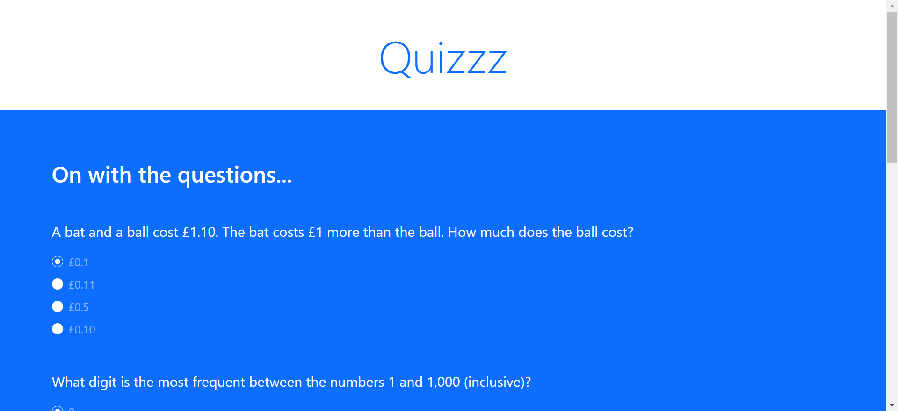
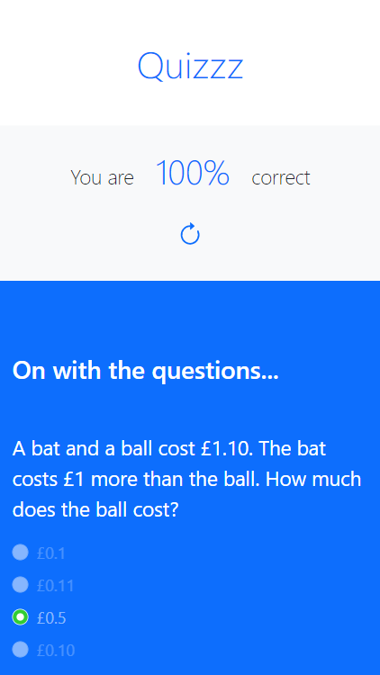
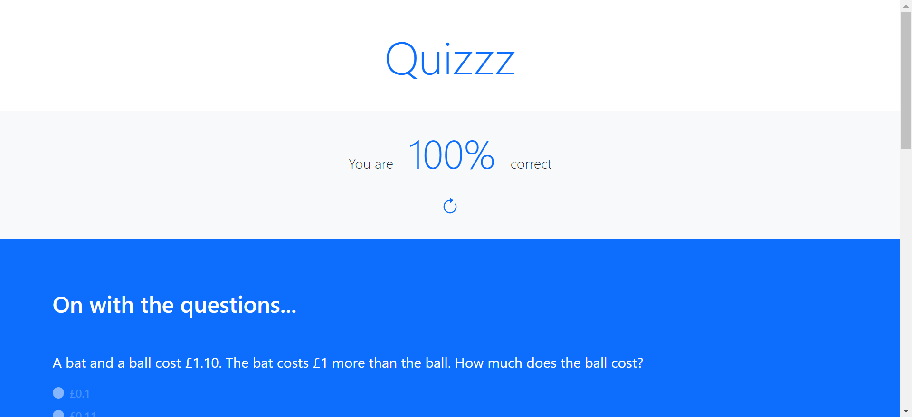
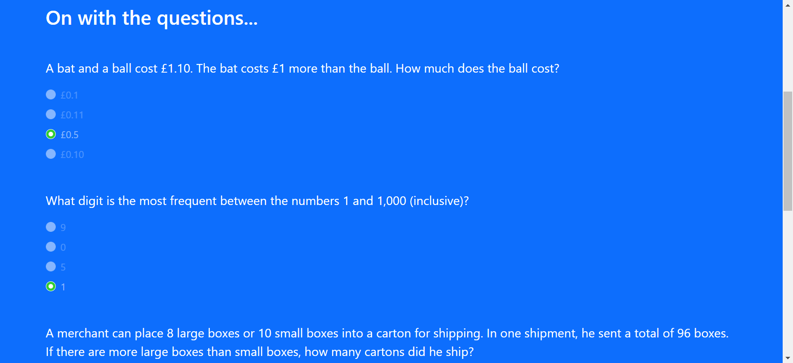

# Quizzz

This is a site where students can take quizzes and see their results. 

### Website preview
[Quizzz](https://gitaccsithu.github.io/Quizzz/). 

## Table of contents

- [Overview](#overview)
  - [Screenshots](#screenshots)
- [My process](#my-process)
  - [Built with](#built-with)
  - [Details about the project](#Details-about-the-project)
- [Author](#author)

## Overview

### Screenshots

- Desktop view

- Mobile view

## My process

### Built with

- Vanilla JavaScript
- Semantic HTML5 markup
- Bootstrap

### Details about the project

Students can take quizzes with multiple-choice forms. There are preloaded correct answers in the JavaScript file. When the student answers all of the answers and submits these, this website will scroll up to the place where the total score will show up. Then the total score will show up with a nice count-up animation.  All of the rights answers will show with green radio buttons and mistakes will show with red.  The student can retake the quiz exam by clicking the reload arrow button. 

## Author

- Developer Name - Sithu Myo Set
- Mail - [Sithu Myo Set](sithuzx123@gmail.com)
- Facebook - [Sithu Myo Set](https://www.facebook.com/profile.php?id=100007418655004)

